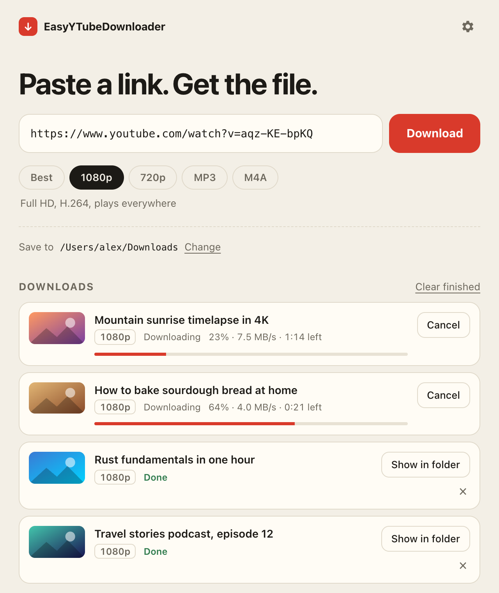

<div align="center">


# EasyYTubeDownloader

**Paste a link. Get the file.** A simple, free YouTube downloader for macOS, Windows and Linux, with a one-click button right on YouTube.

[](https://github.com/eeeyyeeezz/EasyYTubeDownloader/releases/latest)
[](https://github.com/eeeyyeeezz/EasyYTubeDownloader/actions/workflows/ci.yml)
[](LICENSE)

**English** · [Русский](README.ru.md)

<br/>


</div>

---

## Features

- **One click**: paste a link (the app even picks it up from your clipboard) and press **Download**.
- **Formats that just work**: best quality (up to 4K/8K), 1080p or 720p MP4 that plays everywhere, MP3 with cover art, or M4A.
- **Browser extension** for Chrome, Edge, Brave and Firefox adds a **⬇ Download** button under every YouTube video.
- **Playlists**, a download queue, progress, speed and time left.
- **Stays working**: the download engine ([yt-dlp](https://github.com/yt-dlp/yt-dlp)) updates itself daily, so YouTube changes don't break the app. The app itself offers new versions in one click (from 0.1.2 on).
- **Small and private**: the installer is about 3–10 MB and there is no tracking. The app only talks to YouTube, and to GitHub to download and update its tools.
- English and Russian interface, light and dark theme.

## Download

Go to **[Releases → latest](https://github.com/eeeyyeeezz/EasyYTubeDownloader/releases/latest)** and pick the file for your system:

| Your system | File to download |
|---|---|
| **macOS** (Apple Silicon and Intel) | `EasyYTubeDownloader_x.y.z_universal.dmg` |
| **Windows** 10 / 11 | `EasyYTubeDownloader_x.y.z_x64-setup.exe` |
| **Linux**, any distro | `EasyYTubeDownloader_x.y.z_amd64.AppImage` |
| **Ubuntu / Debian / Mint** | `EasyYTubeDownloader_x.y.z_amd64.deb` |
| **Fedora / openSUSE** | `EasyYTubeDownloader-x.y.z-1.x86_64.rpm` |
| Linux on ARM (e.g. Raspberry Pi 5) | `…_aarch64.AppImage` or `…_arm64.deb` |

Install it the usual way:

- **macOS**: open the `.dmg` and drag the app into **Applications**.
- **Windows**: run the `-setup.exe`. No administrator rights are needed. An `.msi` is also available for managed installs.
- **Linux**: `sudo apt install ./EasyYTubeDownloader_*.deb`, or make the AppImage executable and run it (see below).

On the first launch the app downloads its tools (yt-dlp, ffmpeg and Deno, about 100–150 MB). This happens only once.

## First launch

The app is open source but **not code-signed yet**: signing certificates cost money. Your system will warn you the first time. This is expected, and you only need to do it once.

<details>
<summary><b>macOS: "cannot be opened" or "is damaged"</b></summary>

1. Try to open the app once, then close the warning.
2. Open **System Settings → Privacy & Security**, scroll down and click **Open Anyway** next to *EasyYTubeDownloader*.
3. Confirm with **Open**.

If macOS says the app **"is damaged and can't be opened"**, run this once in **Terminal**:

```bash
xattr -cr /Applications/EasyYTubeDownloader.app
```
</details>

<details>
<summary><b>Windows: "Windows protected your PC"</b></summary>

SmartScreen shows this for new apps without a paid certificate. Click **More info → Run anyway**.
</details>

<details>
<summary><b>Linux: AppImage won't start</b></summary>

```bash
chmod +x EasyYTubeDownloader_*.AppImage
./EasyYTubeDownloader_*.AppImage
```

If it complains about FUSE, install it: `sudo apt install libfuse2` (on Ubuntu 24.04 the package is `libfuse2t64`).
</details>

## Browser extension

The extension adds **⬇ Download** and **♪ MP3** buttons under YouTube videos, a right-click menu item and a toolbar popup. It only passes the link to the app, so **the app must be installed**.

<details open>
<summary><b>Chrome, Edge, Brave, Opera, Vivaldi</b></summary>

The Chrome Web Store doesn't allow YouTube downloaders, so the extension is installed manually:

1. Download `easyytubedownloader-chrome-x.y.z.zip` from [Releases](https://github.com/eeeyyeeezz/EasyYTubeDownloader/releases/latest) and **unzip it** into a folder you'll keep, for example `Documents/EasyYTD-extension`.
2. Open `chrome://extensions` (Edge: `edge://extensions`).
3. Turn on **Developer mode** (top-right corner).
4. Click **Load unpacked** and select the unzipped folder.
5. Pin the extension from the 🧩 menu if you want the toolbar button.
</details>

<details open>
<summary><b>Firefox</b></summary>

- The add-on isn't published on Firefox Add-ons (AMO) yet. Once it is, the link will be here.
- **Until then:** download `easyytubedownloader-firefox-x.y.z.zip`, open `about:debugging#/runtime/this-firefox`, click **Load Temporary Add-on…** and pick the zip. Firefox removes temporary add-ons when it restarts.
</details>

The first time you click **Download**, the browser asks *"Open EasyYTubeDownloader?"*. Tick **Always allow** and click **Open**.

## How to use

1. **Copy** a YouTube link, or open a video and use the extension button.
2. **Choose** a format: Best, 1080p, 720p, MP3 or M4A.
3. **Download.** Files go to your *Downloads* folder by default. Change it under **Save to**.

To download a whole playlist, paste a playlist link and tick **Download the whole playlist**. Each playlist gets its own folder.

## Troubleshooting

<details>
<summary><b>"YouTube asked to confirm you're not a bot" / age-restricted videos</b></summary>

YouTube blocks requests from many IP addresses (some countries, mobile carriers, VPNs and shared networks) until you sign in. To fix it in one click:

1. Make sure you're signed in to YouTube in one of your browsers.
2. In the failed download, pick that browser and press **Retry with my browser's account**.

The app reads that browser's YouTube cookies on your computer and passes them to yt-dlp. They never go anywhere except YouTube. The choice is saved, so later downloads just work. You can change it under **Settings → Use cookies from browser**.

- **Firefox** works best everywhere: no extra prompts.
- **Your account:** yt-dlp's authors warn that YouTube may temporarily or permanently restrict accounts used with downloaders. For occasional downloads this is unlikely; for heavy use, sign in with a spare account.
- **macOS:** Chrome-based browsers ask for Keychain access once (press *Always Allow*). Safari needs Full Disk Access for the app.
- **Windows:** Chrome, Edge and Brave encrypt their cookies so they can't be read. Use **Firefox**.

**Another option is a VPN or proxy.** If YouTube only opens in your browser through a proxy app, the downloader needs it too. The app picks up the system proxy automatically, and you can enter one under **Settings → Proxy**, for example `socks5://127.0.0.1:1080`.
</details>

<details>
<summary><b>Downloads suddenly stopped working</b></summary>

YouTube changes things from time to time. Open **Settings → Download engine → Update now**. If that doesn't help, click **Reinstall**.
</details>

<details>
<summary><b>Clicking the extension button does nothing</b></summary>

- Make sure the app is installed and was opened at least once.
- If you dismissed the *"Open EasyYTubeDownloader?"* prompt, click the button again and allow it.
- On Linux with the AppImage, start the app once so it can register the `easyytd://` link handler.
</details>

<details>
<summary><b>Where are the app's tools stored?</b></summary>

| OS | Folder |
|---|---|
| macOS | `~/Library/Application Support/io.github.eeeyyeeezz.easyytd/engine` |
| Windows | `%LOCALAPPDATA%\io.github.eeeyyeeezz.easyytd\engine` |
| Linux | `~/.local/share/io.github.eeeyyeeezz.easyytd/engine` |

You can delete this folder at any time. The app downloads the tools again on the next launch.
</details>

## How it works

```
Browser extension ──easyytd://download?url=…──▶ Desktop app (Tauri: Rust + Svelte)
                                                   │ runs
                                                   ▼
                                  yt-dlp  +  ffmpeg  +  Deno
```

- The **desktop app** is built with [Tauri 2](https://tauri.app). Its UI is Svelte, and the backend is Rust: it runs the download queue and launches yt-dlp.
- On first run the app downloads **[yt-dlp](https://github.com/yt-dlp/yt-dlp)**, **[ffmpeg](https://ffmpeg.org)** and **[Deno](https://deno.com)** from their official GitHub releases and verifies each file's SHA-256 checksum. YouTube requires a JavaScript runtime, which is why Deno is needed. The tools stay outside the app bundle, so yt-dlp can update itself.
- The **extension** never downloads anything itself. It opens an `easyytd://` link, and the app accepts only YouTube URLs from such links.

## Build from source

You'll need [Node.js](https://nodejs.org) 22+, [Rust](https://rustup.rs) and the [Tauri prerequisites](https://tauri.app/start/prerequisites/) for your OS.

```bash
git clone https://github.com/eeeyyeeezz/EasyYTubeDownloader.git
cd EasyYTubeDownloader/app
npm install
npm run tauri dev      # run in development mode
npm run tauri build    # build installers into src-tauri/target/release/bundle
```

Extension:

```bash
cd extension
npm install
npm run build          # unpacked builds in dist/chrome and dist/firefox
npm run package        # zip files in artifacts/
```

Tests and checks: `cargo test` and `cargo clippy` in `app/src-tauri`, `npm run check` in `app`, `npm run lint` in `extension`.

### Releasing (maintainers)

```bash
node scripts/set-version.mjs 0.2.0
git commit -am "Release 0.2.0"
git tag v0.2.0 && git push && git push --tags
```

GitHub Actions builds every installer and the extension and attaches them to a **draft** release. Review it and press **Publish**. To also submit the Firefox add-on automatically, add the `AMO_JWT_ISSUER` and `AMO_JWT_SECRET` repository secrets ([AMO API keys](https://addons.mozilla.org/developers/addon/api/key/)).

## Project layout

```
app/            desktop app (Tauri)
  src/          UI (Svelte 5)
  src-tauri/    Rust backend: engine manager, download queue, deep links
extension/      browser extension (Manifest V3, Chrome + Firefox)
.github/        CI and release workflows
scripts/        helper scripts
```

## Contributing

Issues and pull requests are welcome. Please run the checks above before opening a PR. To add a translation, copy `app/src/lib/i18n/en.json` and `extension/_locales/en/messages.json`.

## Credits

The actual downloading is done by [yt-dlp](https://github.com/yt-dlp/yt-dlp), with [FFmpeg](https://ffmpeg.org) and [Deno](https://deno.com) doing their part. The app is built on [Tauri](https://tauri.app) and [Svelte](https://svelte.dev). macOS ffmpeg builds come from [ffmpeg-static](https://github.com/eugeneware/ffmpeg-static), and Windows/Linux builds from [yt-dlp/FFmpeg-Builds](https://github.com/yt-dlp/FFmpeg-Builds).

## Disclaimer

This project is not affiliated with YouTube or Google. Use it only to download content that you own, that is in the public domain or under a license that allows downloading, or that you have permission to download. You are responsible for complying with YouTube's Terms of Service and the copyright laws of your country.

## License

[MIT](LICENSE). The third-party tools downloaded at runtime keep their own licenses: yt-dlp (Unlicense), FFmpeg (GPL), and Deno (MIT).
