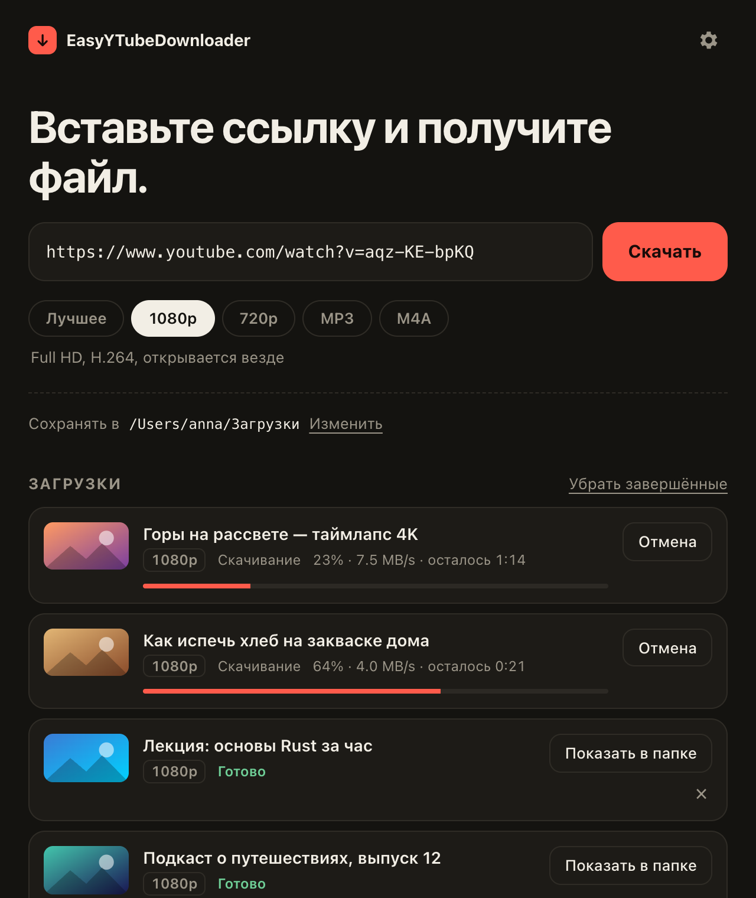

<div align="center">


# EasyYTubeDownloader

**Вставьте ссылку и получите файл.** Простая бесплатная программа для скачивания видео с YouTube для macOS, Windows и Linux. Кнопка «Скачать» появляется прямо на YouTube.

[](https://github.com/eeeyyeeezz/EasyYTubeDownloader/releases/latest)
[](https://github.com/eeeyyeeezz/EasyYTubeDownloader/actions/workflows/ci.yml)
[](LICENSE)

[English](README.md) · **Русский**

<br/>


</div>

---

## Возможности

- **В один клик.** Вставьте ссылку (приложение само подхватит её из буфера обмена) и нажмите **Скачать**.
- **Форматы, которые просто работают.** Лучшее качество (до 4K/8K), MP4 в 1080p или 720p (открывается везде), MP3 с обложкой или M4A.
- **Расширение для браузера** (Chrome, Edge, Brave, Firefox) добавляет кнопку **⬇ Скачать** под каждым видео на YouTube.
- **Плейлисты** и очередь загрузок. Видно прогресс, скорость и сколько осталось.
- **Не ломается.** Движок загрузки ([yt-dlp](https://github.com/yt-dlp/yt-dlp)) обновляется сам каждый день, поэтому изменения на YouTube не выводят программу из строя.
- **Лёгкая и приватная.** Установщик весит около 3–10 МБ, никакой слежки. Приложение обращается только к YouTube и к GitHub, чтобы скачать и обновить свои инструменты.
- Интерфейс на русском и английском, светлая и тёмная тема.

## Скачать

Откройте **[Releases → latest](https://github.com/eeeyyeeezz/EasyYTubeDownloader/releases/latest)** и выберите файл для своей системы:

| Ваша система | Какой файл скачать |
|---|---|
| **macOS** (Apple Silicon и Intel) | `EasyYTubeDownloader_x.y.z_universal.dmg` |
| **Windows** 10 / 11 | `EasyYTubeDownloader_x.y.z_x64-setup.exe` |
| **Linux**, любой дистрибутив | `EasyYTubeDownloader_x.y.z_amd64.AppImage` |
| **Ubuntu / Debian / Mint** | `EasyYTubeDownloader_x.y.z_amd64.deb` |
| **Fedora / openSUSE** | `EasyYTubeDownloader-x.y.z-1.x86_64.rpm` |
| Linux на ARM (например, Raspberry Pi 5) | `…_aarch64.AppImage` или `…_arm64.deb` |

Установка обычная:

- **macOS:** откройте `.dmg` и перетащите приложение в **Программы**.
- **Windows:** запустите `-setup.exe`. Права администратора не нужны. Для корпоративной установки есть ещё `.msi`.
- **Linux:** `sudo apt install ./EasyYTubeDownloader_*.deb`, либо сделайте AppImage исполняемым и запустите (см. ниже).

При первом запуске приложение скачивает свои инструменты: yt-dlp, ffmpeg и Deno, примерно 100–150 МБ. Это происходит один раз.

## Первый запуск

У приложения открытый исходный код, но оно **пока не подписано**: сертификаты для подписи платные. Поэтому при первом запуске система покажет предупреждение. Это нормально, и сделать нужно один раз.

<details>
<summary><b>macOS: «не удаётся открыть» или «повреждено»</b></summary>

1. Попробуйте открыть приложение один раз и закройте предупреждение.
2. Откройте **Системные настройки → Конфиденциальность и безопасность**, пролистайте вниз и нажмите **Всё равно открыть** рядом с *EasyYTubeDownloader*.
3. Подтвердите кнопкой **Открыть**.

Если macOS пишет, что приложение **«повреждено и не может быть открыто»**, выполните один раз в **Терминале**:

```bash
xattr -cr /Applications/EasyYTubeDownloader.app
```
</details>

<details>
<summary><b>Windows: «Система Windows защитила ваш компьютер»</b></summary>

SmartScreen показывает это для новых программ без платного сертификата. Нажмите **Подробнее → Выполнить в любом случае**.
</details>

<details>
<summary><b>Linux: AppImage не запускается</b></summary>

```bash
chmod +x EasyYTubeDownloader_*.AppImage
./EasyYTubeDownloader_*.AppImage
```

Если появляется ошибка про FUSE, установите его: `sudo apt install libfuse2` (в Ubuntu 24.04 пакет называется `libfuse2t64`).
</details>

## Расширение для браузера

Расширение добавляет под видео кнопки **⬇ Скачать** и **♪ MP3**, пункт в меню правой кнопки и окошко на панели браузера. Само оно только передаёт ссылку в приложение, поэтому **приложение должно быть установлено**.

<details open>
<summary><b>Chrome, Edge, Brave, Opera, Vivaldi</b></summary>

Chrome Web Store не пропускает загрузчики YouTube, поэтому расширение ставится вручную:

1. Скачайте `easyytubedownloader-chrome-x.y.z.zip` из [Releases](https://github.com/eeeyyeeezz/EasyYTubeDownloader/releases/latest) и **распакуйте** в папку, которую не будете удалять. Например, `Документы/EasyYTD-extension`.
2. Откройте `chrome://extensions` (в Edge: `edge://extensions`).
3. Включите **Режим разработчика** в правом верхнем углу.
4. Нажмите **Загрузить распакованное расширение** и выберите распакованную папку.
5. Если нужна кнопка на панели, закрепите расширение через меню 🧩.
</details>

<details open>
<summary><b>Firefox</b></summary>

- В каталоге Firefox Add-ons (AMO) дополнение пока не опубликовано. Когда появится, ссылка будет здесь.
- **А пока:** скачайте `easyytubedownloader-firefox-x.y.z.zip`, откройте `about:debugging#/runtime/this-firefox`, нажмите **Загрузить временное дополнение…** и выберите zip. Временные дополнения удаляются после перезапуска Firefox.
</details>

При первом нажатии **Скачать** браузер спросит *«Открыть EasyYTubeDownloader?»*. Поставьте галочку **Всегда разрешать** и нажмите **Открыть**.

## Как пользоваться

1. **Скопируйте** ссылку на YouTube или откройте видео и нажмите кнопку расширения.
2. **Выберите** формат: Лучшее, 1080p, 720p, MP3 или M4A.
3. **Скачайте.** По умолчанию файлы сохраняются в папку *Загрузки*. Поменять её можно в строке **Сохранять в**.

Чтобы скачать весь плейлист, вставьте ссылку на плейлист и отметьте **Скачать весь плейлист**. Каждый плейлист сохраняется в отдельную папку.

## Если что-то не работает

<details>
<summary><b>«YouTube просит подтвердить, что вы не бот» или видео 18+</b></summary>

YouTube блокирует запросы со многих IP-адресов (некоторые страны, мобильные операторы, VPN и общие сети), пока вы не войдёте в аккаунт. Исправить можно в один клик:

1. Убедитесь, что вы вошли в YouTube в одном из своих браузеров.
2. В карточке неудачной загрузки выберите этот браузер и нажмите **Повторить со входом**.

Приложение прочитает cookies YouTube из этого браузера на вашем компьютере и передаст их в yt-dlp. Никуда, кроме YouTube, они не отправляются. Выбор сохраняется, и следующие загрузки просто работают. Поменять браузер можно в **Настройки → Cookies из браузера**.

- **Firefox** лучше всего работает везде: без лишних запросов.
- **macOS:** браузеры на основе Chrome один раз спросят доступ к Связке ключей (нажмите *Всегда разрешать*). Для Safari приложению нужен «Полный доступ к диску».
- **Windows:** Chrome, Edge и Brave шифруют cookies так, что их нельзя прочитать. Используйте **Firefox**.

**Другой вариант — VPN или прокси.** Если YouTube открывается в браузере только через прокси-приложение, загрузчику оно тоже нужно. Приложение само подхватывает системный прокси, а свой можно указать в **Настройки → Прокси**, например `socks5://127.0.0.1:1080`.
</details>

<details>
<summary><b>Загрузки вдруг перестали работать</b></summary>

YouTube время от времени что-то меняет. Откройте **Настройки → Движок загрузки → Обновить**. Если не помогло, нажмите **Переустановить**.
</details>

<details>
<summary><b>Кнопка расширения ничего не делает</b></summary>

- Проверьте, что приложение установлено и запускалось хотя бы один раз.
- Если вы закрыли вопрос *«Открыть EasyYTubeDownloader?»*, нажмите кнопку ещё раз и разрешите.
- На Linux с AppImage запустите приложение один раз, чтобы оно зарегистрировало обработчик ссылок `easyytd://`.
</details>

<details>
<summary><b>Где лежат инструменты приложения?</b></summary>

| ОС | Папка |
|---|---|
| macOS | `~/Library/Application Support/io.github.eeeyyeeezz.easyytd/engine` |
| Windows | `%APPDATA%\io.github.eeeyyeeezz.easyytd\engine` |
| Linux | `~/.local/share/io.github.eeeyyeeezz.easyytd/engine` |

Эту папку можно удалить в любой момент. При следующем запуске приложение скачает инструменты заново.
</details>

## Как это устроено

```
Расширение браузера ──easyytd://download?url=…──▶ Приложение (Tauri: Rust + Svelte)
                                                     │ запускает
                                                     ▼
                                    yt-dlp  +  ffmpeg  +  Deno
```

- **Приложение** написано на [Tauri 2](https://tauri.app). Интерфейс на Svelte, а бэкенд на Rust ведёт очередь загрузок и запускает yt-dlp.
- При первом запуске приложение скачивает **[yt-dlp](https://github.com/yt-dlp/yt-dlp)**, **[ffmpeg](https://ffmpeg.org)** и **[Deno](https://deno.com)** из их официальных релизов на GitHub и проверяет контрольную сумму SHA-256 каждого файла. Deno нужен потому, что YouTube требует JavaScript-рантайм. Инструменты лежат отдельно от приложения, поэтому yt-dlp может обновляться сам.
- **Расширение** само ничего не скачивает. Оно открывает ссылку `easyytd://`, а приложение принимает из таких ссылок только адреса YouTube.

## Сборка из исходников

Понадобятся [Node.js](https://nodejs.org) 22+, [Rust](https://rustup.rs) и [зависимости Tauri](https://tauri.app/start/prerequisites/) для вашей ОС.

```bash
git clone https://github.com/eeeyyeeezz/EasyYTubeDownloader.git
cd EasyYTubeDownloader/app
npm install
npm run tauri dev      # запуск в режиме разработки
npm run tauri build    # установщики появятся в src-tauri/target/release/bundle
```

Расширение:

```bash
cd extension
npm install
npm run build          # распакованные сборки в dist/chrome и dist/firefox
npm run package        # zip-архивы в artifacts/
```

Тесты и проверки: `cargo test` и `cargo clippy` в `app/src-tauri`, `npm run check` в `app`, `npm run lint` в `extension`.

### Выпуск релиза (для мейнтейнеров)

```bash
node scripts/set-version.mjs 0.2.0
git commit -am "Release 0.2.0"
git tag v0.2.0 && git push && git push --tags
```

GitHub Actions соберёт все установщики и расширение и прикрепит их к **черновику** релиза. Проверьте его и нажмите **Publish**. Чтобы дополнение для Firefox тоже отправлялось в каталог автоматически, добавьте в секреты репозитория `AMO_JWT_ISSUER` и `AMO_JWT_SECRET` ([ключи AMO API](https://addons.mozilla.org/developers/addon/api/key/)).

## Структура проекта

```
app/            приложение (Tauri)
  src/          интерфейс (Svelte 5)
  src-tauri/    бэкенд на Rust: движок, очередь загрузок, ссылки easyytd://
extension/      расширение (Manifest V3, Chrome + Firefox)
.github/        CI и сборка релизов
scripts/        вспомогательные скрипты
```

## Участие в разработке

Issues и pull request'ы приветствуются. Перед PR, пожалуйста, запустите проверки из раздела выше. Чтобы добавить перевод, скопируйте `app/src/lib/i18n/en.json` и `extension/_locales/en/messages.json`.

## Благодарности

Скачиванием занимается [yt-dlp](https://github.com/yt-dlp/yt-dlp), ему помогают [FFmpeg](https://ffmpeg.org) и [Deno](https://deno.com). Приложение собрано на [Tauri](https://tauri.app) и [Svelte](https://svelte.dev). Сборки ffmpeg для macOS взяты из [ffmpeg-static](https://github.com/eugeneware/ffmpeg-static), для Windows и Linux из [yt-dlp/FFmpeg-Builds](https://github.com/yt-dlp/FFmpeg-Builds).

## Отказ от ответственности

Проект не связан с YouTube или Google. Скачивайте только тот контент, который принадлежит вам, находится в общественном достоянии или под лицензией, разрешающей скачивание, либо на который у вас есть разрешение. Вы сами отвечаете за соблюдение Условий использования YouTube и законов об авторском праве вашей страны.

## Лицензия

[MIT](LICENSE). Сторонние инструменты, которые скачиваются при работе, распространяются под своими лицензиями: yt-dlp (Unlicense), FFmpeg (GPL), Deno (MIT).
